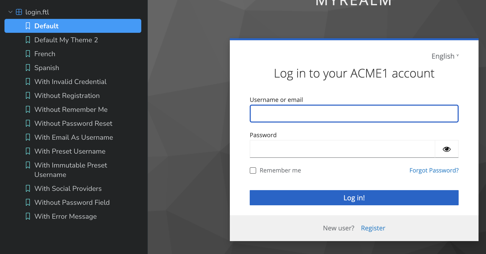

# Multi-Page

## Initializing the Multi-Page Account Theme

<figure><figcaption><p>The Multi-Page Account theme before customization</p></figcaption></figure>

You've made your mind and opted for the Multi-Page Account theme?  \
Great, let's start by initializing you theme: &#x20;

```bash
npx keycloakify initialize-account-theme
```

When asked, select "Multi-Page". &#x20;

This command will create the nessesary boilerplate for you. &#x20;

Beyond that there isn't much thing you need to be aware of, things works exactly as in the login theme. You'll be able to use the  keycloakify`add-story` and `eject-page` CLI command just select account when asked.

## Using the REST API

Even if you're using the Multi-Page theme you can still consume the REST API the Single-Page Account is build on top of. So, if some information you need are missing from the `kcContext` you can fetch them dynamically.




Branch of the starter template modified to call the Account REST API


You can find the code for the Account v3 theme [here](https://github.com/keycloak/keycloak/tree/main/js/apps/account-ui/src/api). This will help you infer all the available endpoints. You can also enable the Account v3 theme in your Keycloak and use the network tab to see the available endpoints.
