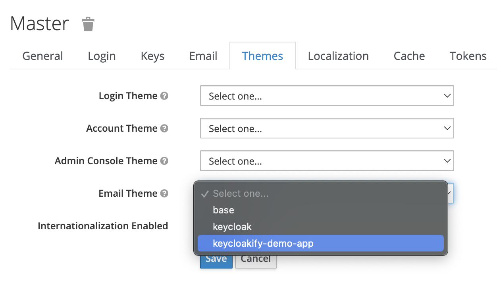

# 📧 Email Customization

_Introduced in_ [_v4.8.0_](https://github.com/InseeFrLab/keycloakify/releases/tag/v4.8.0)


Currently, customizing emails with React is not possible, and you must use FreeMarker instead. If this poses a significant obstacle for you, please [open a new issue](https://github.com/keycloakify/keycloakify/issues/new) to discuss it further.


It is now possible to customize the emails sent to your users to confirm their email address ect.\
Just run npx keycloakify `npx keycloakify initialize-email-theme`.

For this script to work you must be in one of these scenarios:

* `src/login` or `src/account` exists, if it's the case it will assume that this is a standalone keycloak theme and create `src/email`
* There is a `keycloak-theme` directory somewhere in your `src` directory. If it's the case it will create `src/**/keycloak-theme/email`.

This directory should be tracked by Git (`yarn add -A`) You can start hacking the default template.

You can remove all the template and resource file you aren't going to customize (it will fallback to the default email theme as long as you keep a `theme.properties` with `parent=base`).\
When `npx keycloakify` (`yarn keycloak`) is run it will bundle your email theme into your `.jar` file and you will be able to select it in the Keycloak administration pages.

