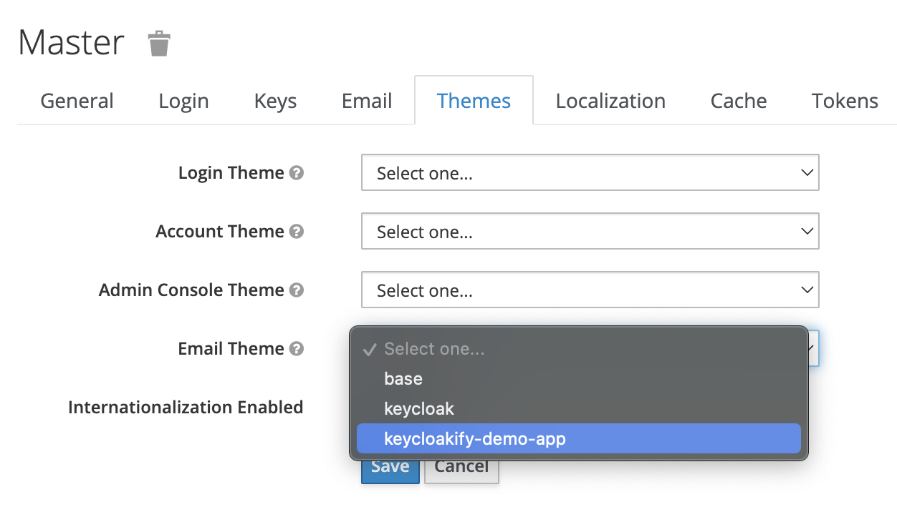

# 📧 Email Customization

_Introduced in_ [_v4.8.0_](https://github.com/InseeFrLab/keycloakify/releases/tag/v4.8.0)


Keycloakify does not yet officially integrate a way to customize emails with React.\
However, there is a [Keycloakify plugin for React email](https://github.com/timofei-iatsenko/keycloakify-emails) that you can try out.


It is possible to customize the emails sent to your users to confirm their email addresses etc.\
Just run npx keycloakify `npx keycloakify initialize-email-theme`.

You will be prompted to select the Keycloak version you want to initialize your theme with. I recommend selecting the most recent one, even if you are currently deploying on an older Keycloak version. Everything should work.

You can remove all the template and resource files you aren't going to customize (it will fallback to the default email theme as long as you keep a `theme.properties` with `parent=base`).\
When `npx keycloakify` (`yarn keycloak`) is run, it will bundle your email theme into your `.jar` file, and you will be able to select it in the Keycloak administration pages.


For theme variants, read [this](theme-variants.md#email-theme).

