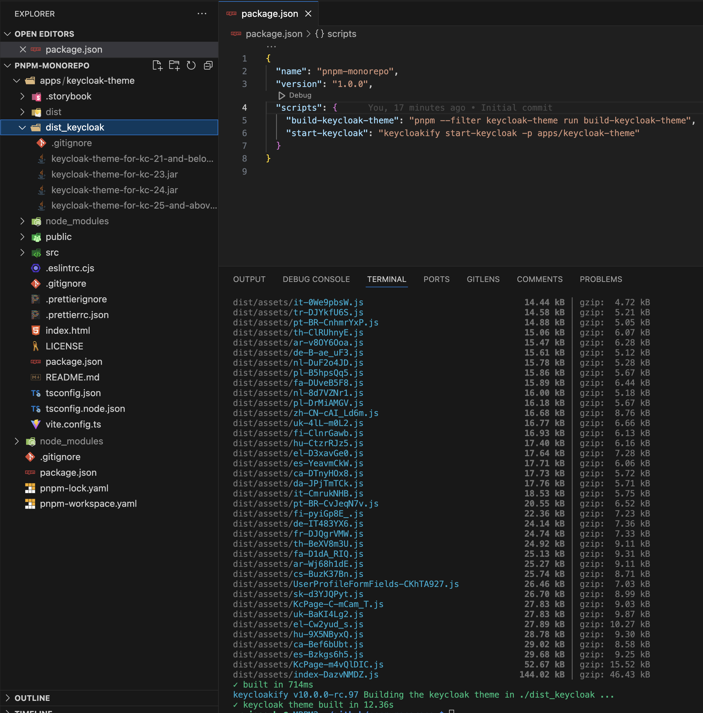

# Package Manager Workspaces

Let's assume we have a monorepo project where sub applications are stored in the **apps/** directory.



<pre class="language-json" data-title="package.json"><code class="lang-json">{
  "name": "my-monorepo",
<strong>  "workspaces": [
</strong><strong>    "apps/*"
</strong><strong>    "packages/*"
</strong><strong>  ],
</strong><strong>  "private": true,
</strong></code></pre>




```yaml
packages:
  - "apps/*"
  - "packages/*"
```




Then, you want to create a new app called, for example 'keycloak-theme' and initialize it with the code of the starter template:

```bash
cd my-monorepo
git clone https://github.com/keycloakify/keycloakify-starter apps/keycloak-theme
rm -rf apps/keycloak-theme/.git
rm -rf apps/keycloak-theme/.github
rm apps/keycloak-theme/.yarn.lock
```

<figure><figcaption></figcaption></figure>

Now you want to update the name field of your apps/keycloak-theme/package.json to match the name of your sub app.


```diff
 {
-    "name": "keycloakify-starter",
+    "name": "keycloak-theme",
```


You also want to provide an actual name to your theme as you want it to [appear in the Keycloak Admin UI](https://github.com/keycloakify/keycloakify/assets/6702424/7da4afe2-0f67-4f79-a3d0-bd982636ea23).

<pre class="language-typescript" data-title="apps/keycloak-theme/vite.config.ts"><code class="lang-typescript">import { defineConfig } from "vite";
import react from "@vitejs/plugin-react";
import { keycloakify } from "keycloakify/vite-plugin";

// https://vitejs.dev/config/
export default defineConfig({
    plugins: [react(), keycloakify({
<strong>        themeName: "my-app"
</strong>    })]
});
</code></pre>

Now you can add a script in your root package json to build the theme and start the keycloak dev server:



<pre class="language-json" data-title="package.json"><code class="lang-json">{
   "name": "my-monorepo",
   "scripts": {
<strong>       "build-keycloak-theme": "pnpm --filter keycloak-theme run build-keycloak-theme",
</strong><strong>       "start-keycloak": "keycloakify start-keycloak -p apps/keycloak-theme"
</strong>   },
   // ...
}
</code></pre>



<pre class="language-json" data-title="package.json"><code class="lang-json">{
   "name": "my-monorepo",
   "scripts": {
<strong>       "build-keycloak-theme": "yarn workspace keycloak-theme run build-keycloak-theme",
</strong><strong>       "start-keycloak": "keycloakify start-keycloak -p apps/keycloak-theme"
</strong>   },
   // ...
}
</code></pre>



<pre class="language-json" data-title="package.json"><code class="lang-json">{
   "name": "my-monorepo",
   "scripts": {
<strong>       "build-keycloak-theme": "npm run build-keycloak-theme --workspace=keycloak-theme",
</strong><strong>       "start-keycloak": "keycloakify start-keycloak -p apps/keycloak-theme"
</strong>   },
   // ...
}
</code></pre>



<pre class="language-json" data-title="package.json"><code class="lang-json">{
   "name": "my-monorepo",
   "scripts": {
<strong>       "build-keycloak-theme": "bun run --cwd apps/keycloak-theme build-keycloak-theme",
</strong><strong>       "start-keycloak": "keycloakify start-keycloak -p apps/keycloak-theme"
</strong>   },
   // ...
}
</code></pre>



Now you can run:



```bash
pnpm install
pnpm run build-keycloak-theme
```



```bash
yarn
yarn build-keycloak-theme
```



```bash
npm install
npm run build-keycloak-theme
```



```bash
bun install
bun run build-keycloak-theme
```



<figure><figcaption></figcaption></figure>

Two common thing you might want to do is [change the location of the directory where the JARs files are generated](../../configuration-options/keycloakifybuilddirpath.md) and [only build the JAR for the Keycloak version you are using](../../targeting-specific-keycloak-versions.md).

<pre class="language-typescript" data-title="apps/keycloak-theme/vite.config.ts"><code class="lang-typescript">import { defineConfig } from "vite";
import react from "@vitejs/plugin-react";
import { keycloakify } from "keycloakify/vite-plugin";

// https://vitejs.dev/config/
export default defineConfig({
    plugins: [react(), keycloakify({
        themeName: "my-app",
<strong>        keycloakifyBuildDirPath: "../../dist/apps/keycloak-theme",
</strong><strong>        keycloakVersionTargets: {
</strong><strong>            hasAccountTheme: true,
</strong><strong>            "21-and-below": false,
</strong><strong>            "23": false,
</strong><strong>            "24": false,
</strong><strong>            "25-and-above": "keycloak-theme.jar"
</strong><strong>        }
</strong>    })]
});
</code></pre>

In this configuration when you run `pnpm run build-keycloak-theme` from the root of your monorepo a single `keycloak-theme.jar` will be generated in **dist/apps/keycloak-theme**:

<figure><figcaption></figcaption></figure>

When you want to use the keycloakify CLI commands you can either cd into your keycloakify sub app directory or use the [--project option of the Keycloakify CLI](../../configuration-options/project.md).\
Like for example if you want to run add-story you can do either:

* `cd apps/keycloak-theme && npx keycloakify add-story`
* `npx keycloakify add-story -p apps/keycloakify-theme` from the root of your monorepo.
