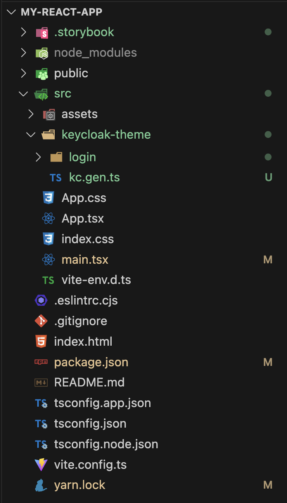

# In your Vite Project

If you have a Vite/React/TypeScript project you can integrate Keycloakify directly inside it.

In this guide we're going to work with a vanilla Vite project.

<figure><figcaption><p>Creating a new vite project with yarn create vite. You don't need to create a new project. Just use your existing codebase.</p></figcaption></figure>

<figure><figcaption><p>Our codebase before installing Keycloakify</p></figcaption></figure>


Before anything make sure to commit all your pending changes so you can easily revert changes if need be.


Let's start by installing Keycloakify (and optionally Storybook) to our project:



```bash
yarn add keycloakify
yarn add --dev storybook @storybook/react @storybook/react-vite
```



```bash
pnpm add keycloakify
pnpm add --dev storybook @storybook/react @storybook/react-vite
```



```bash
bun add keycloakify
bun add --dev storybook @storybook/react @storybook/react-vite
```



```bash
npm install --save keycloakify
npm install --save-dev storybook @storybook/react @storybook/react-vite
```



Next we want to repatriate the relevant files from [the starter template](https://github.com/keycloakify/keycloakify-starter) into our project:

```bash
cd my-react-app
git clone https://github.com/keycloakify/keycloakify-starter tmp
mv tmp/src src/keycloak-theme
mv tmp/.storybook .
rm -rf tmp
rm src/keycloak-theme/vite-env.d.ts
mv src/keycloak-theme/main.tsx src/main.tsx
```

<figure><figcaption><p>State of your codebase after bringin in the Keycloakify boilerplate code.<br>Note thate the keycloak-theme (or keycloak_theme) directory can be located anywhere under your src directory.</p></figcaption></figure>

Now you want to modify your entry point so that:

* If the kcContext global is defined, render your Keycloakify theme
* Else, reder your App as usual.

Let's say, for example, your **src/main.tsx** file currently looks like this:


```tsx
import { StrictMode } from "react";
import { createRoot } from "react-dom/client";
import App from "./App";
import "./index.css";
import { MyProvider } from "./MyProvider";

createRoot(document.getElementById('root')!).render(
    <StrictMode>
      <MyProvider>
        <App />
      </MyProvider>
    </StrictMode>,
);
```


You want to **rename** this file to src/main.app.tsx (for example) and modify it as follow:


```tsx
import App from "./App.tsx";
import "./index.css";
import { MyProvider } from "./MyProvider.tsx";

export default function AppEntrypoint() {
  return (
    <MyProvider>
      <App />
    </MyProvider>
  )
}
```



If you have some top level `await` and you don't know how to deal with thoses, join [the discord server](https://discord.com/invite/kYFZG7fQmn), I can help you out.


Then you want to create the following **src/main.tsx** file, you can copy paste the followint code, it does not need to be adapted:


```tsx
import { createRoot } from "react-dom/client";
import { StrictMode, lazy, Suspense } from "react";
import { KcPage, type KcContext } from "./keycloak-theme/kc.gen";
const AppEntrypoint = lazy(() => import("./main.app"));

// The following block can be uncommented to test a specific page with `yarn dev`
// Don't forget to comment back or your bundle size will increase
/*
import { getKcContextMock } from "./keycloak-theme/login/KcPageStory";

if (import.meta.env.DEV) {
    window.kcContext = getKcContextMock({
        pageId: "register.ftl",
        overrides: {}
    });
}
*/

createRoot(document.getElementById("root")!).render(
    <StrictMode>
        {window.kcContext ? (
            <KcPage kcContext={window.kcContext} />
        ) : (
            <Suspense>
                <AppEntrypoint />
            </Suspense>
        )}
    </StrictMode>
);

declare global {
    interface Window {
        kcContext?: KcContext;
    }
}
```



**Question:**

Why do my main application and Keycloak theme share the same entry point?

**Answer:**

To simplify the build process. If you don't want it to negatively impact the performance of your application, it's essential to understand the following points:

* **Different Contexts:** The application (`App`) and Keycloak page (`KcPage`) are mounted in very different contexts. Avoid sharing providers between the two at the `main.tsx` file level. The true entry point of your application is the `AppEntrypoint` component defined in `main.app.tsx`, while the entry point for your Keycloak theme is the `KcPage` component. Be careful about what code is shared between them.
* **Responsibility of main.tsx:** The `main.tsx` file should only determine the context (either the application or Keycloak) and mount the appropriate component (`App` or `KcPage`). It should not contain any substantial logic or dependencies.
* **Performance Considerations:** Keep `main.tsx` as lightweight as possible to avoid increasing the initial load time of both your main application and login pages. For example, do not load any state management libraries like `redux-toolkit` at this level.


You also need to use Keycloakify's Vite plugin. Here we don't provide any [build options](../../configuration-options/) but you probably at least want to define [keycloakVersionTargets](../../configuration-options/keycloakversiontargets.md).

<pre class="language-tsx" data-title="vite.config.ts"><code class="lang-tsx">import { defineConfig } from 'vite'
import react from '@vitejs/plugin-react'
<strong>import { keycloakify } from "keycloakify/vite-plugin";
</strong>
// https://vitejs.dev/config/
export default defineConfig({
  plugins: [
    react(), 
<strong>    keycloakify({
</strong><strong>        accountThemeImplementation: "none"
</strong><strong>    })
</strong>  ],
})
</code></pre>


Leave accountThemeImplementation set to "none" for now.\
To initialize the account theme refer to [this guide](https://github.com/keycloakify/docs.keycloakify.dev/blob/v10/keycloakify-in-my-codebase/in-your-react-project/broken-reference/README.md).


Finally you want to add to your package.json a script for building the theme and another one to start storybook.

<pre class="language-json" data-title="package.json"><code class="lang-json">{
  "name": "my-react-app",
  "type": "module",
  "scripts": {
    "dev": "vite",
    "build": "tsc -b &#x26;&#x26; vite build",
    "lint": "eslint . --ext ts,tsx --report-unused-disable-directives --max-warnings 0",
    "preview": "vite preview",
<strong>    "build-keycloak-theme": "npm run build &#x26;&#x26; keycloakify build",
</strong><strong>    "storybook": "storybook dev -p 6006"
</strong>  },
  // ...
</code></pre>

Last setp is to exclude from your html `<head />` things that aren't relevent in the context of Keycloak pages. &#x20;


Do not blindely copy paste, this is just an example! &#x20;

You have to figure out what does and does not make sense to be in the \<head/> of your Keycloak UI pages.


<pre class="language-html" data-title="public/index.html"><code class="lang-html">&#x3C;!doctype html>
&#x3C;html>

&#x3C;head>
    &#x3C;meta charset="UTF-8" />
    &#x3C;link rel="icon" type="image/svg+xml" href="/vite.svg" />
    &#x3C;meta name="viewport" content="width=device-width, initial-scale=1.0" />

<strong>    &#x3C;meta name="keycloakify-ignore-start">
</strong>    &#x3C;title>ACME Dashboard&#x3C;/title>
    &#x3C;script>
        window.ENV = {
            API_ADDRESS: '${API_ADDRESS}',
            SENTRY_DSN: '${SENTRY_DSN}'
        };
    &#x3C;/script>
<strong>    &#x3C;meta name="keycloakify-ignore-end">
</strong>    
    &#x3C;!-- ... -->

&#x3C;/head>

&#x3C;!-- ... -->
</code></pre>

In the above example we tell keycloakify not to include the `<title>` because keycloakify will set it dynamically to something like _"ACME- Login"_ or _"ACME - Register"_. &#x20;

We also exclude a placeholder script for injecting environnement variables at container startup.


**That's it, your project is ready to go!** :tada:

You can run npm run build-keycloak-theme, the JAR distribution of your Keycloak theme will be generated in dist\_keycloak.

You're now able to use all the Keycloakify commands (`npx keycloakify --help`) from the root of your project.


If you're currently using [keycloak-js](https://www.npmjs.com/package/keycloak-js) or [react-oidc-context](https://github.com/authts/react-oidc-context) to manage user authentication in your app you might want to checkout [oidc-spa](https://www.oidc-spa.dev/), the alternative from the Keycloakify team.

If you have any issues [reach out on Discord](https://discord.gg/mJdYJSdcm4)! We're here to help!



[testing-your-theme](../../testing-your-theme/)



[customization-strategies](../../customization-strategies/)

