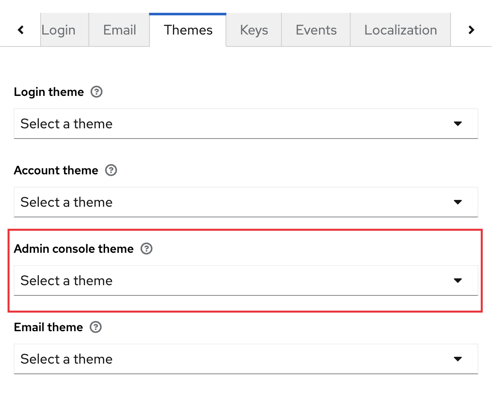

# ⚠ Limitations

### Some pages still have the default theme. Why?

This project only support out of the box the most common user facing pages of Keycloak login.

To see the complete list of pages that Keycloak provide you can download the base theme with the following command

`npx -p keycloakify download-builtin-keycloak-theme`&#x20;

[Video demo](https://user-images.githubusercontent.com/6702424/164304458-934b0e1d-9de7-4bb4-8a1c-e06a70b1636a.mov) &#x20;

[Here](https://github.com/InseeFrLab/keycloakify/tree/main/src/login/pages) are the login pages currently implemented vs [all the existing pages](https://github.com/keycloak/keycloak/tree/main/themes/src/main/resources/theme/base/login). &#x20;

[Here](https://github.com/InseeFrLab/keycloakify/tree/main/src/account/pages) are the acount pages currently implemented vs [all the existing pages](https://github.com/keycloak/keycloak/tree/main/themes/src/main/resources/theme/base/account).

#### I have established that a page that I need isn't supported out of the box by Keycloakify, now what? &#x20;




[contributing.md](contributing.md)




Keycloakify also enables you to declare custom ftl pages. &#x20;

Check out how `my-extra-page-1.ftl` and `my-extra-page-2.ftl` where added to [the demo project](https://github.com/garronej/keycloakify-demo-app/tree/look\_and\_feel). &#x20;

Main takeaways are:

* (TS only) You must declare theses page in the type argument of the getter function for the `kcContext` in order to have the correct typings. [example](https://github.com/garronej/keycloakify-demo-app/blob/4eb2a9f63e9823e653b2d439495bda55e5ecc134/src/KcApp/kcContext.ts#L16-L21)
* (TS only) If you use Keycloak plugins that defines non standard `.ftl` values (Like for example [this plugin](https://github.com/micedre/keycloak-mail-whitelisting) that define `authorizedMailDomains` in `register.ftl`) you should declare theses value to get the type. [example](https://github.com/garronej/keycloakify-demo-app/blob/4eb2a9f63e9823e653b2d439495bda55e5ecc134/src/KcApp/kcContext.ts#L6-L13)
* You should provide sample data for all the non standard value if you want to be able to debug the page outside of keycloak. [example](https://github.com/garronej/keycloakify-demo-app/blob/4eb2a9f63e9823e653b2d439495bda55e5ecc134/src/KcApp/kcContext.ts#L28-L43)



### `process.env.PUBLIC_URL` not supported.

You won't be able to [import things from your public directory **in your JavaScript code** (it's supported in `public/index.html`)](https://create-react-app.dev/docs/using-the-public-folder/#adding-assets-outside-of-the-module-system). (This isn't recommended anyway).

### Self hosted fonts

This scenario **won't** work


```css
@font-face {
  font-family: Marianne;
  src: url("./fonts/Marianne-Light.woff2") format("woff2");
  font-weight: 300;
  font-style: normal;
  font-display: swap;
}
```



```html
<link rel="stylesheet" href="%PUBLIC_URL%/font.css" />
```


As a workaround you can have your `@font-face` import directly in a style tage of your index.html `<head />`.


```diff
-<link rel="stylesheet" href="%PUBLIC_URL%/font.css" />
+<style>
+ @font-face {
+   font-family: Marianne;
+   src: url("%PUBLIC_URL%/fonts/Marianne-Light.woff2") format("woff2");
+   font-weight: 300;
+   font-style: normal;
+   font-display: swap;
+ }
+</style>
```



Make sure `%PUBLIC_URL%/fonts/Marianne-Light.woff2` actually point to the font file.


Example [here](https://github.com/garronej/keycloakify-demo-app/blob/9aa2dbaec28a7786d6b2983c9a59d393dec1b2d6/public/index.html#L27-L73) (and the font are [here](https://github.com/garronej/keycloakify-demo-app/tree/main/public/fonts/WorkSans)).

#### Other workarounds

* You can circumvent the problem by avoiding hosting your font yourself using Google Fonts, Font Awesome  or any other font provider.
* You can [self host your font somewhere](https://github.com/garronej/keycloakify-demo-app/blob/2de8a9eb6f5de9c94f9cd3991faad0377e63268c/src/fonts.scss#L16), you will need to enable [`Access-Control-Allow-Origin`](https://github.com/garronej/keycloakify-demo-app/blob/2de8a9eb6f5de9c94f9cd3991faad0377e63268c/nginx.conf#L17-L19) on the server serving your fonts.

### Admin Console Theme not supported

<figure><figcaption></figcaption></figure>

If you are missing this feature [open an issue about it](https://github.com/InseeFrLab/keycloakify/issues/new).

### Wellcome page not customizable

The following page isn't customizable yet.

<figure><figcaption></figcaption></figure>

It's however planned to enable this. Follow the progress in [this issue](https://github.com/keycloakify/keycloakify/issues/148).

### Field Names can't be runtime generated

Keycloakify analyze your code to see what field name are used. As a result your field names should be hard coded in your code (If you are [using user profile](realtime-input-validation.md) you don't have to worry about it). &#x20;

```jsx
// OK ✅
messagesPerField.exists("foo-bar")

// Not OK 🛑
const bar= "bar";
messagesPerField.exists(`foo-${bar}`);
```


Feeling overwhelmed? Check out our exclusive sponsor's Cloud IAM consulting services to simplify your experience.

