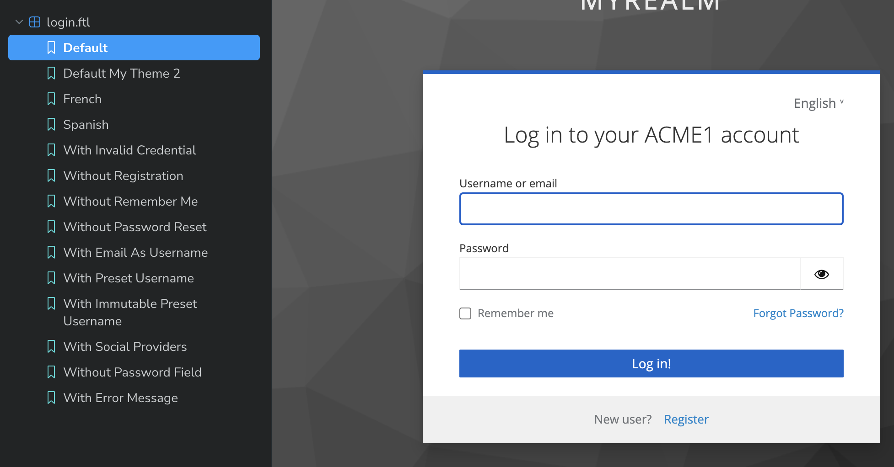

# 📄 Terms and conditions

The tems and condition page ([terms.ftl](https://storybook.keycloakify.dev/?path=/story/login-terms-ftl--default)) is a page that, if enabled as required action on you Keycloak server, will requiers your users to approve your terms and condition upon registration. &#x20;

<figure><figcaption></figcaption></figure>

## Enabling in Keycloak

