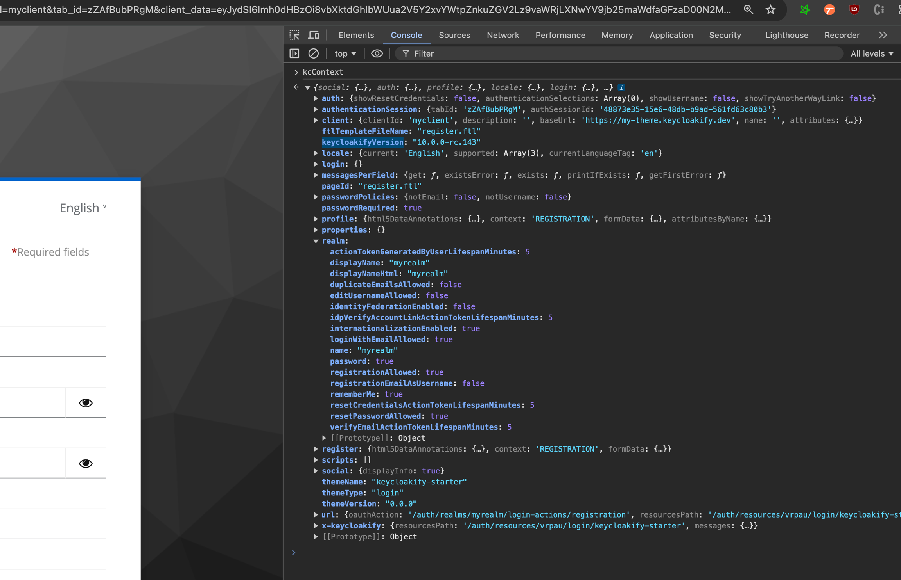

# There is too much info exposed in window.kcContext

You might be worried about the kcContext exposing too much information from your Keycloak Server Configuration.

<figure><figcaption></figcaption></figure>

However you can rest assured that this object does not contains any sensitive information—only the information that the Keycloak team considers relevent for rendering the various login pages.

That being said you might have reasons to want to remove some specific values. There is a Keycloakify compiler option for this:


[kcContextExclusionsFtl](https://app.gitbook.com/s/R6NEbefzmQd6FlEZFJWf/features/compiler-options/kccontextexclusionsftl)


